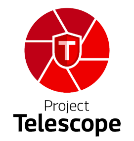

# Project Telescope
## Concept Document

### Problem Space
With more and more organisations utilising OpenShift for their cloud migration/development initiatives, there has been an increased focus on security due to the high exposure of recent system breaches and critical CVEs (Common Vulnerabilities & Exposures).

The majority of organisations already have many security policies for securely building, deploying and running containers at scale but it can be hard to achieve observability at the government level.
Security policies document what needs to be done, why it needs to be done and how to achieve it whereas governance is the ability to detect if they are being actively applied.  An example is shown below:

* Policy “Why” statement:
  * Using a SAST tool will improve the overall quality of the code developed and reduce risk by identifying possible issues early in the development lifecycle.
* Policy “What” statement:
  * Static Application Security Testing (SAST) must be carried out before an application is deployed to the staging environment.
* Policy “How” statement:
  * Within BigCorp Inc, we recommend using SonarQube or Codacy.

This is a perfectly sensible policy but assumes that all development teams will adhere to it.  

Governance is the ability to demonstrate at a high level that this policy is being enforced across all development  teams.  With these metrics you can further measure risk and take appropriate action if required.

### Objectives

The objective of Project Telescope is to provide this observability in a simple and holistic  dashboard which cuts across all projects and development teams to provide a straightforward binary (red or green) indication of governance status.  

The solution should be tool agnostic with the input streams being received via APIs using a modular plug-in concept.  Examples are plug-ins for Splunk integration, Elasticsearch, Jira plug-in, etc.  

The dashboard should be capable of displaying data through various lenses.
* Project Lens: Do these projects adhere to all the relevant policies?
* Policy Lens:  Is this policy compliant across multiple projects?
* Team Lens:  Do all projects within this team conform to the security policies?
* Risk Priority Lens: Which areas have the highest risk profile?

Six areas have initially identified which could feed data into the Telescope solution:
1. Secure Logging & Monitoring
2. Secure Data
3. Secure Infrastructure
4. Secure Integrations
5. Secure Code
6. Vulnerability Scanning

The MVP won’t initially provide alerting functionality as this will remain the perdue of the current organisation’s solution.

### Outcomes

The main outcome will be to enable DevSecOps teams (and CISOs) to quickly identify possible areas of concern and allow for better collaboration across multi-functional teams.  Using a plug-in framework will allow development teams to build their own integration points and share them across the organisation.  

The solution should then allow customers to have visibility and reconcile any inconsistent deployment of security policies, best practices and standards and also provide strategic alignment of information security focused on their institutional objectives.

It is not intended to be a dashboard which apportions blame to development teams or points fingers at specific individuals but to provide better guidance to teams and provide blameless post-mortems.

The ideal outcome would be for this to be an open source solution with organisations sharing integration plug-ins, bug fixes and creating additional functionality.
